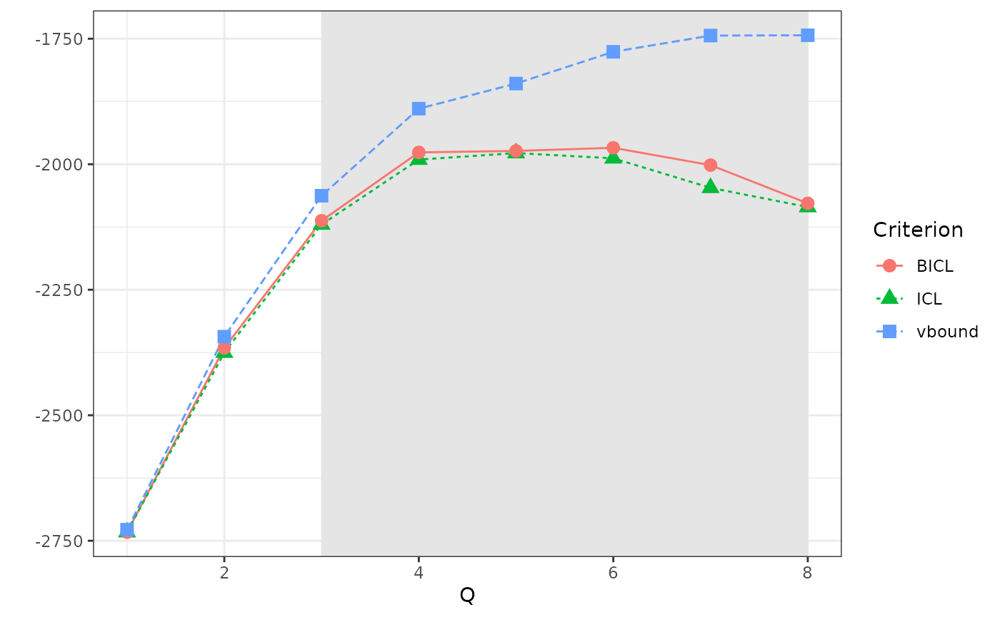
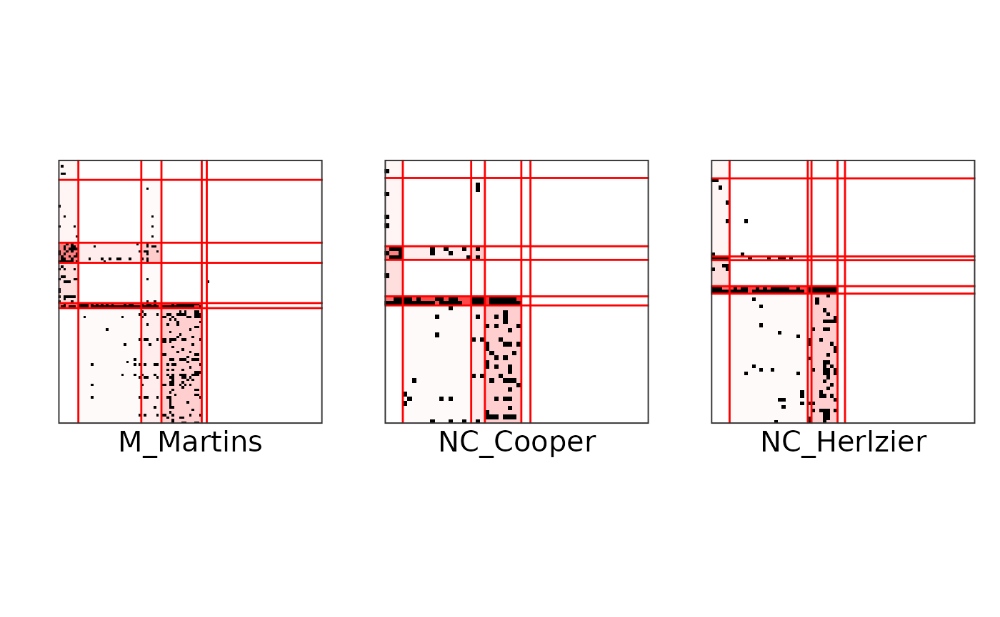
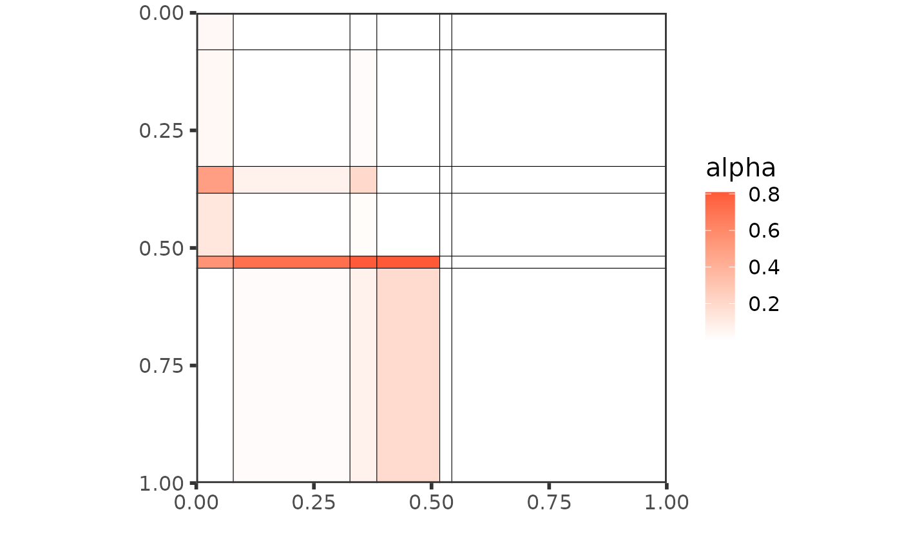
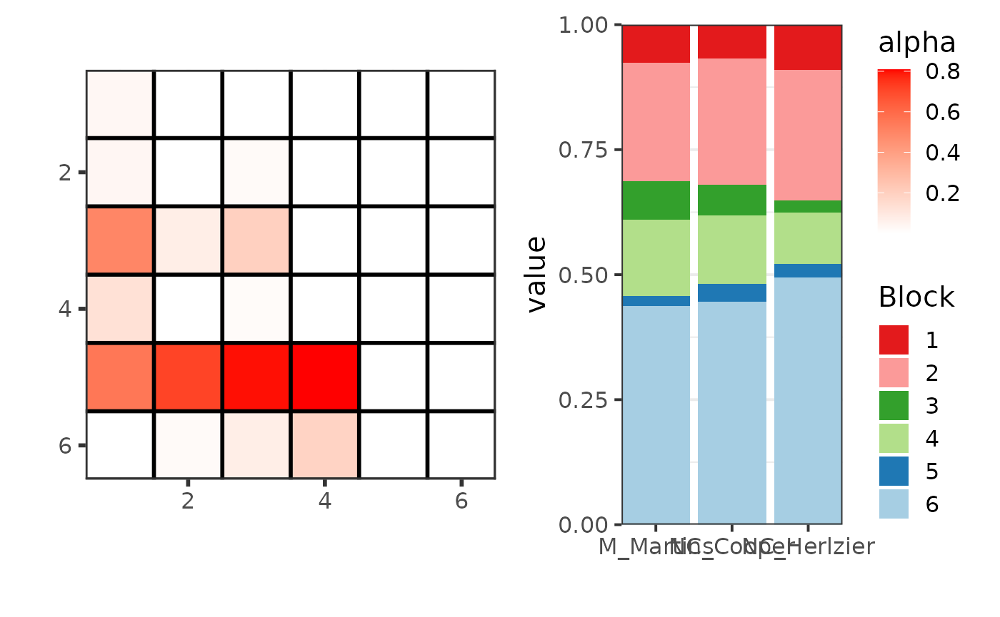
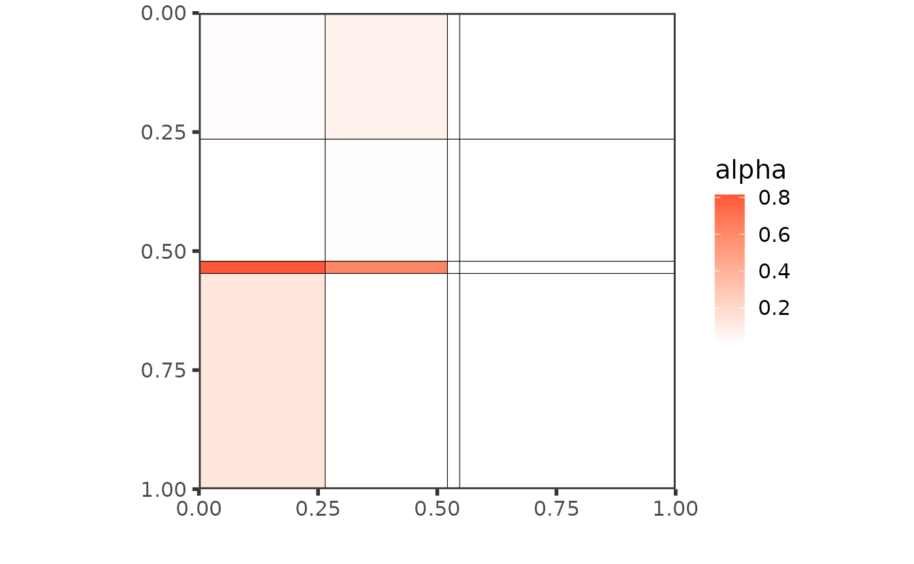
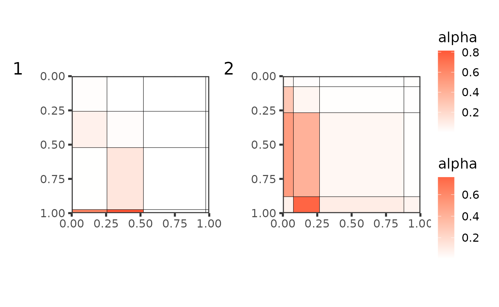

# Tutorial on food webs

``` r

library(colSBM)
library(patchwork)
data("foodwebs")
```

## Estimation with colSBM

We load a list of 8 foodwebs. They are binary directed networks with
different number of species. First, we are going to model jointly the
first $`3`$ networks, using the iid-colSBM model.

``` r

# global_opts = list(nb_cores = 1L,
#                    nb_models = 5L,
#                    nb_init = 10L,
#                    depth = 2L,
#                    verbosity = 1,
#                    spectral_init = FALSE,
#                    Q_max = 8L,
#                    plot_details = 1)

set.seed(1234)
res_fw_iid <- estimate_colSBM(
  netlist = foodwebs[1:3], # A list of networks
  colsbm_model = "iid", # The name of the model
  directed = TRUE, # Foodwebs are directed networks
  net_id = names(foodwebs)[1:3], # Name of the networks
  nb_run = 1L, # Number of runs of the algorithm
  global_opts = list(
    verbosity = 0,
    plot_details = 0,
    Q_max = 8
  ) # Max number of clusters
)
```

We can look at how the variational bound and the model selection
criteria evolve with the number of clusters. Here, the BICL criterion
selects Q = 6 blocks.

``` r

plot(res_fw_iid)
```



``` r

best_fit <- res_fw_iid$best_fit
```

## Results and analysis

Here are some useful fields to analyze the results.

``` r

best_fit
#> Fitted Collection of Simple SBM -- bernoulli variant for 3 networks 
#> =====================================================================
#> Dimension = ( 105 58 71 ) - ( 6 ) blocks.
#> BICL =  -1967.254  -- #Empty blocks :  0  
#> =====================================================================
#> * Useful fields 
#>   $distribution, $nb_nodes, $nb_clusters, $support, $Z 
#>   $memberships, $parameters, $BICL, $vbound, $pred_dyads
```

We can get:

- the estimation of the model parameters

``` r

best_fit$parameters
#> $alpha
#>              [,1]         [,2]         [,3]         [,4]         [,5]
#> [1,] 1.337284e-03 1.855419e-10 0.0379944789 1.036529e-11 4.232057e-06
#> [2,] 7.125890e-01 2.916621e-08 0.5523050570 9.448324e-10 8.086073e-01
#> [3,] 1.422084e-05 9.845693e-11 0.0342935378 6.575492e-12 2.697802e-09
#> [4,] 2.019119e-02 1.434655e-09 0.0005668503 7.879153e-11 1.866794e-01
#> [5,] 5.387169e-06 4.879625e-10 0.1275977515 7.992381e-04 9.099859e-10
#> [6,] 7.400179e-02 2.978761e-09 0.4974226156 5.319729e-10 1.534667e-04
#>              [,6]
#> [1,] 2.052649e-02
#> [2,] 7.996047e-01
#> [3,] 3.464961e-07
#> [4,] 7.360008e-02
#> [5,] 1.820506e-02
#> [6,] 1.987907e-01
#> 
#> $pi
#> $pi[[1]]
#> [1] 0.24801191 0.02564113 0.07861710 0.45691659 0.13378060 0.05703266
#> 
#> $pi[[2]]
#> [1] 0.24801191 0.02564113 0.07861710 0.45691659 0.13378060 0.05703266
#> 
#> $pi[[3]]
#> [1] 0.24801191 0.02564113 0.07861710 0.45691659 0.13378060 0.05703266
#> 
#> 
#> $delta
#> [1] 1 1 1
```

- The block memberships:

``` r

best_fit$Z
#> [[1]]
#>      Unidentified sp1 FW_009   Terrestrial plant material 
#>                            2                            2 
#>    Terrestrial invertebrates        Achnanthes lanceolata 
#>                            6                            4 
#>              Batrachospermum         Calothrix sp1 FW_009 
#>                            4                            4 
#>         Cocconeis placentula         Cosmarium sp1 FW_009 
#>                            4                            4 
#>        Cyclotella sp1 FW_009              Cymbella aspera 
#>                            4                            4 
#>           Cymbella cuspidata               Cymbella kappi 
#>                            4                            4 
#>              Cymbella tumida              Diatoma heimale 
#>                            4                            4 
#>              Epithemia sorex            Epithemia turgida 
#>                            4                            4 
#>           Eunotia serpentina      Unidentified sp2 FW_009 
#>                            4                            4 
#>           Euntoia pectinalis        Fragilaria sp1 FW_009 
#>                            4                            4 
#>        Fragilaria vaucheriae         Frustulia rhomboides 
#>                            4                            4 
#>        Gomphoneis herculeana       Gomphonema accuminatum 
#>                            4                            4 
#>        Gomphonema angustatum         Gomphonema truncatum 
#>                            4                            4 
#>      Unidentified sp3 FW_009             Melosira varians 
#>                            4                            4 
#>            Navicula avenacea           Navicula dicephala 
#>                            4                            4 
#>              Nitzschia dubia        Oedogonium sp1 FW_009 
#>                            4                            4 
#>        Phormidium sp1 FW_009         Pinnularia mesolepta 
#>                            4                            4 
#>           Pinnularia viridis    Pleaurotaenium sp1 FW_009 
#>                            4                            4 
#>         Rhoicospenia curvata        Rhopalodia sp1 FW_009 
#>                            4                            4 
#>       Schizothrix sp1 FW_009       Staurastrum sp1 FW_009 
#>                            4                            4 
#>            Surirella elegans             Surirella tenera 
#>                            4                            4 
#>                 Synedra ulna        Tabellaria fenestrata 
#>                            4                            4 
#>        Tabellaria flocculosa          Ulothrix sp1 FW_009 
#>                            4                            4 
#>      Unidentified sp4 FW_009      Unidentified sp5 FW_009 
#>                            4                            4 
#>        Acroneuria sp1 FW_009          Aelosoma sp1 FW_009 
#>                            3                            6 
#>         Alloperla sp1 FW_009         Anepeorus sp1 FW_009 
#>                            4                            3 
#>             Antocha saxicola                       Baetis 
#>                            1                            5 
#>               Boyeria vinosa Bryophaenocladius sp1 FW_009 
#>                            1                            1 
#>        Chauliodes sp1 FW_009            Chimarra atterima 
#>                            3                            6 
#>      Unidentified sp6 FW_009     Conchapelopia sp1 FW_009 
#>                            5                            6 
#>       Cryptolabis sp1 FW_009         Cyrnellus sp1 FW_009 
#>                            1                            1 
#>     Dicrotendipes sp1 FW_009          Diplectrona modesta 
#>                            5                            5 
#>             Ectopria nervosa   Endochironomous sp1 FW_009 
#>                            5                            6 
#>       Ephemerella sp1 FW_009  Eukieferiella pseudomontana 
#>                            1                            1 
#>   Eukiefferiella 'dark' type        Glossosoma sp1 FW_009 
#>                            5                            1 
#>          Gyraulus sp1 FW_009            Haploperla brevis 
#>                            5                            1 
#>          Hexatoma sp1 FW_009                Hydrophilidae 
#>                            3                            1 
#>  Hydropsyche sp1 FW_009arana            Larsia sp1 FW_009 
#>                            6                            1 
#>        Leucrocuta sp1 FW_009           Leuctra sp1 FW_009 
#>                            5                            5 
#>      Unidentified sp7 FW_009      Metriocnemus sp1 FW_009 
#>                            6                            5 
#>         Micrasema sp1 FW_009        Ochthebius sp1 FW_009 
#>                            1                            1 
#>      Ophiogomphus sp1 FW_009  Paraleptophlebia sp1 FW_009 
#>                            3                            1 
#>  Paranyctiophylax sp1 FW_009     Polycentropus sp1 FW_009 
#>                            1                            1 
#>         Probezzia sp1 FW_009        Promoresia sp1 FW_009 
#>                            1                            5 
#>         Psephenus sp1 FW_009 Pseudolimnolphila sp1 FW_009 
#>                            5                            1 
#>       Rhyacophila sp1 FW_009          Simulium sp1 FW_009 
#>                            1                            5 
#>        Sphaerium occidentale     Stempelinella sp1 FW_009 
#>                            1                            5 
#>            Stenelmis crenata         Stenelmis sp1 FW_009 
#>                            5                            5 
#>           Suwalia sp1 FW_009        Tallaperla sp1 FW_009 
#>                            1                            6 
#>           Tanytarsus Genus A     Tricorythodes sp1 FW_009 
#>                            1                            1 
#>        Notropis heterolepsis                  Brook trout 
#>                            3                            3 
#>           Orcnocetes virilis       Rhinichthys cataractae 
#>                            1                            3 
#>            Cambarus bartonii 
#>                            1 
#> 
#> [[2]]
#>     Unidentified sp1 FW_012_01      Terrestrial invertebrates 
#>                              2                              4 
#>                 Plant material          Achnanthes lanceolata 
#>                              2                              4 
#>         Achnanthes minutissima      Audouinella sp1 FW_012_01 
#>                              4                              4 
#>                Batrachospermum               Blue-green algae 
#>                              4                              4 
#>                      Calothrix               Cymbella cistula 
#>                              4                              4 
#>               Cymbella mulleri                Diatoma heimale 
#>                              4                              4 
#>                Epithemia sorex              Epithemia turgida 
#>                              4                              4 
#>             Eunotia pectinalis          Eunotia sp1 FW_012_01 
#>                              4                              4 
#>           Frustulia rhomboides          Gomphoneis herculeana 
#>                              4                              4 
#>          Gomphonema intricatum       Gomphonema sp1 FW_012_01 
#>                              4                              4 
#>             Meridion circulare              Navicula avenacea 
#>                              4                              4 
#>                  Pleurotaenium          Rhoicosphenia curvata 
#>                              4                              4 
#>                  Stigeoclonium                   Synedra ulna 
#>                              4                              4 
#>                       Ulothrix     Unidentified sp2 FW_012_01 
#>                              4                              4 
#>                       Aelosoma    Brachycentrus sp1 FW_012_01 
#>                              6                              5 
#>               Cambarus bartoni       Chauliodes sp1 FW_012_01 
#>                              3                              1 
#>         Cordulegaster maculata        Dicranota sp1 FW_012_01 
#>                              1                              1 
#>             Ectopria thoracica                 Epeorus dispar 
#>                              5                              5 
#>       Glossosoma sp1 FW_012_01      Homoplectra sp1 FW_012_01 
#>                              1                              1 
#>       Hudsonimya sp1 FW_012_01      Hydropsyche sp1 FW_012_01 
#>                              1                              6 
#>       Leucrocuta sp1 FW_012_01          Leuctra sp1 FW_012_01 
#>                              5                              1 
#>       Lumbriculiid oligochaete Parametriocnemus sp1 FW_012_01 
#>                              6                              5 
#>     Neureclipsis sp1 FW_012_01     Ophiogomphus sp1 FW_012_01 
#>                              1                              1 
#>        Palpomyia sp1 FW_012_01        Palpomyia sp2 FW_012_01 
#>                              1                              1 
#>       Promoresia sp1 FW_012_01        Psephenus sp1 FW_012_01 
#>                              5                              5 
#>        Soliperla sp1 FW_012_01                Stenelmis adult 
#>                              3                              1 
#>        Stenelmis sp1 FW_012_01          Suwalia sp1 FW_012_01 
#>                              1                              3 
#>               Tallaperla maria        Thaumalea sp1 FW_012_01 
#>                              1                              5 
#>             Tipula abdominalis                     Salamander 
#>                              1                              3 
#> 
#> [[3]]
#>    Unidentified sp1 FW_012_02            Terrestrial plants 
#>                             2                             2 
#>              Terrestrial bugs Achnanthes inflata var. elata 
#>                             1                             4 
#>         Achnanthes lanceolata           Achnanthes linearis 
#>                             4                             4 
#>        Achnanthes minutissima           Auodinella hermanii 
#>                             4                             4 
#>              Blue Green algae                     Calothrix 
#>                             4                             4 
#>          Cocconeis placentula                Cymbella kappi 
#>                             4                             4 
#>              Cymbella mulleri               Diatoma heimale 
#>                             4                             4 
#>             Epithemia turgida              Eunotia meisteri 
#>                             4                             4 
#>            Eunotia pectinalis         Fragilaria vaucheriae 
#>                             4                             4 
#>          Frustulia rhomboides         Gomphoneis herculeana 
#>                             4                             4 
#>        Gomphonema accuminatum         Gomphonema angustatum 
#>                             4                             4 
#>         Gomphonema intricatum         Gomphonema tennuellum 
#>                             4                             4 
#>                  Marssoniella             Navicula avenacea 
#>                             4                             4 
#>        Navicula cryptocephala               Navicula mutica 
#>                             4                             4 
#>        Navicula sp1 FW_012_02            Pinnularia viridis 
#>                             4                             4 
#>         Rhoicosphenia curvata                    Rhopalodia 
#>                             4                             4 
#>         Surirella brebbisonii             Surirella elegans 
#>                             4                             4 
#>                   Synechoccus                  Synedra ulna 
#>                             4                             4 
#>                      Ulothrix    Unidentified sp2 FW_012_02 
#>                             4                             4 
#>       Aeolosoma sp1 FW_012_02                 Ajax longipes 
#>                             6                             3 
#>               Amphinemura wui           Anchytarsus bicolor 
#>                             1                             1 
#>                        Baetis                    Hudsonimya 
#>                             5                             1 
#>                    Cricotopus                     Dicranota 
#>                             5                             1 
#>  Eukieffidrella pseudomontana           Diplectrona modesta 
#>                             1                             1 
#>                       Dixella                  Dolophilodes 
#>                             1                             3 
#>            Ectopria thoracica                Epeorus dispar 
#>                             5                             5 
#>                  Fatigia pele        Hexatoma sp1 FW_012_02 
#>                             1                             3 
#>                       Leuctra             Oligo Lumbr. Blue 
#>                             5                             5 
#>            Oligo. Lumbr. Pink                  Ophiogomphus 
#>                             1                             1 
#>             Paraleptophelebia                      Pericoma 
#>                             1                             1 
#>                       Pilaria      Pentaneuri sp1 FW_012_02 
#>                             1                             1 
#>       Polycentropus maculatus                     Stenelmis 
#>                             1                             5 
#>              Tallaperla maria                     Tanyderid 
#>                             1                             1 
#>                 Conchapelopia                        Tipula 
#>                             1                             1 
#>              Wormaldia moesta                      Crayfish 
#>                             1                             3 
#>                    Salamander 
#>                             3
```

- The prediction for each dyads in the networks, here for network
  number 3. If your goal is dyad prediction, then you should use
  `colsbm_model = "delta"`, instead of `colsbm_model = "iid"`.

``` r

best_fit$pred_dyads[[3]][1:10, 1:5]
#>                               Unidentified sp1 FW_012_02 Terrestrial plants
#> Unidentified sp1 FW_012_02                  0.000000e+00       3.203932e-08
#> Terrestrial plants                          3.203932e-08       0.000000e+00
#> Terrestrial bugs                            5.150140e-10       5.150140e-10
#> Achnanthes inflata var. elata               1.715692e-09       1.715692e-09
#> Achnanthes lanceolata                       1.715692e-09       1.715692e-09
#> Achnanthes linearis                         1.715692e-09       1.715692e-09
#> Achnanthes minutissima                      1.715692e-09       1.715692e-09
#> Auodinella hermanii                         1.704351e-09       1.704351e-09
#> Blue Green algae                            1.715692e-09       1.715692e-09
#> Calothrix                                   1.715693e-09       1.715693e-09
#>                               Terrestrial bugs Achnanthes inflata var. elata
#> Unidentified sp1 FW_012_02          0.62896381                  5.117223e-08
#> Terrestrial plants                  0.62896381                  5.117223e-08
#> Terrestrial bugs                    0.00000000                  2.653609e-08
#> Achnanthes inflata var. elata       0.01914963                  0.000000e+00
#> Achnanthes lanceolata               0.01914963                  2.608635e-09
#> Achnanthes linearis                 0.01914963                  2.608635e-09
#> Achnanthes minutissima              0.01914963                  2.608635e-09
#> Auodinella hermanii                 0.01901584                  2.601152e-09
#> Blue Green algae                    0.01914963                  2.608635e-09
#> Calothrix                           0.01914963                  2.608635e-09
#>                               Achnanthes lanceolata
#> Unidentified sp1 FW_012_02             3.818738e-09
#> Terrestrial plants                     3.818738e-09
#> Terrestrial bugs                       2.571672e-08
#> Achnanthes inflata var. elata          3.606283e-10
#> Achnanthes lanceolata                  0.000000e+00
#> Achnanthes linearis                    3.606283e-10
#> Achnanthes minutissima                 3.606283e-10
#> Auodinella hermanii                    3.671654e-10
#> Blue Green algae                       3.606283e-10
#> Calothrix                              3.606284e-10
```

We can also plot the networks individually, with the groups reordered by
trophic levels:

``` r

p <- gtools::permutations(best_fit$Q, best_fit$Q)
ind <- which.min(
  sapply(
    seq(nrow(p)),
    function(x) {
      sum((tcrossprod(best_fit$pi[[1]]) * best_fit$alpha)[p[x, ], p[x, ]][
        upper.tri(best_fit$alpha)
      ])
    }
  )
)
ord <- p[ind, ]
plot(res_fw_iid$best_fit, type = "block", net_id = 1, ord = ord) +
  plot(res_fw_iid$best_fit, type = "block", net_id = 2, ord = ord) +
  plot(res_fw_iid$best_fit, type = "block", net_id = 3, ord = ord)
```



Or make different plots to exhibit the mesoscale structure:

``` r

plot(res_fw_iid$best_fit, type = "graphon", ord = ord)
```



``` r

plot(res_fw_iid$best_fit, type = "meso", mixture = TRUE, ord = ord)
```



## Clustering of networks

Let simulate some directed networks with a lower triangular structure
that looks alike foodwebs.

``` r

set.seed(1234)
alpha <- matrix(c(
  .05, .01, .01, .01,
  .3, .05, .01, .01,
  .5, .4, .05, .01,
  .1, .8, .1, .05
), 4, 4, byrow = TRUE)
pi <- c(.1, .2, .6, .1)
sim_net <-
  replicate(3,
    {
      X <-
        sbm::sampleSimpleSBM(100,
          blockProp = pi, connectParam = list(mean = alpha),
          directed = TRUE
        )
      X$rNetwork
      X$networkData
    },
    simplify = FALSE
  )
```

``` r

set.seed(1234)

net_clust <- clusterize_unipartite_networks(
  netlist = c(foodwebs[1:3], sim_net), # A list of networks
  colsbm_model = "iid", # The name of the model
  directed = TRUE, # Foodwebs are directed networks
  net_id = c(names(foodwebs)[1:3], "sim1", "sim2", "sim3"), # Name of the networks
  nb_run = 3L, # Nmber of runs of the algorithm
  global_opts = # List of options
    list(
      verbosity = 0, # Verbosity level of the algorithm
      plot_details = 0, # Monitoring plot of the algorithm
      Q_max = 9, # Max number of clusters
      backend = "parallel" # Backend for parallel computing
    ),
  verbose = FALSE
)
```

We can extract the best partition:

``` r

best_partition <- net_clust$partition
```

The plot of the mesoscale structure of the whole collection is the
following:

``` r

plot(best_partition[[1]])
```



but then we can compare the mesoscale structures of the 2 groups:

``` r

plot(best_partition[[1]],
  type = "graphon",
  ord = order(best_partition[[1]]$alpha %*% best_partition[[1]]$pi[[1]])
) +
  plot(best_partition[[2]],
    type = "graphon",
    ord = order(best_partition[[2]]$alpha %*% best_partition[[2]]$pi[[1]])
  ) +
  plot_layout(guides = "collect") + plot_annotation(tag_levels = "1")
```


